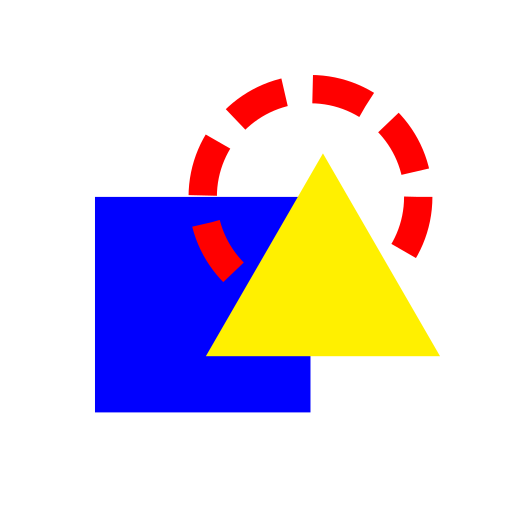

<div align="center">
    
    <h1> Signum </h1>
</div>

Signum is a simple but powerful icon generator engine.

Currently Signum is only setup to work with SVG files (though you can export to any export format Inkscape supports).
In the future support for more formats may be added.

> [!NOTE]
> Signum is still in development and not ready for production use. Some features may be broken and syntax may change in the future.

## Basic Usage

If you have Signum installed, you can use it by running the command `signum [file_name]`,
where `[file_name]` is an optional argument specifying the path to your icon definition file.

You can also try Signum without installing like so:

 - Make sure you have Python 3 and Inkscape installed
 - Clone this repository
 - Navigate to the cloned repo in your terminal
 - Do `python3 src/signum/main.py [filename]` where `[filename]` is the name of your icon definition file (if blank, `icons.txt` is used)

## Installation

 - Make sure you have Python 3 and Inkscape installed
 - Clone this repository
 - Navigate to the cloned repo in your terminal
 - If you hav Just installed you can simply run `just install` in the terminal
 - If you do not have Just, do the following:
  - Install dependencies: `python3 -m pip install -r requirements.txt`
  - Build package: `python3 -m build`
  - Install: `python3 -m pip install ./dist/*.whl`

## Icon Definition File Structure

You tell Signum how to make your icons using an icon definition file.
This file is an INI style config file.
There are a few sections for setting things up (`__config__` and `__palettes__`) and then all other sections are for your icon definitions.

The `__config__` section can have the following options:

- `source` : Directory path containing all your source SVG files.
- `output` : Directory path to output the built icons to. Should be a Python format string, which can use the values: `section`, `size`, `name`, `format`.
- `output_sizes` : Space separated list of numbers. These are the different widths to export the images at.
- `output_formats` : Space separated of file extensions for output files, must include the `.` (Example: `.png`)
- `output_command` : Shell command for outputting the files. By default Signum uses inkscape for exporting. The command should be a Python format string which can make use of the following values: `size`, `src`, `dest`, `format`.
- `scale_stroke_width` : If `true`, scale the stroke width when inserting icons.

For instance, here is the default config values for Signum:

```
[__config__]
source = ./
output = ./dist/{section}/{size}/{name}{format}
output_sizes = 512
output_formats = .png
output_command = inkscape --export-width={size} --export-filename={dest} --export-area-drawing {src}
```

The `__palettes__` section contains palette definitions.
The keys are the palette names, and the values are space separated lists of hex color values, where the odd colors get replaced with the even colors.
For instance:

```
[__palettes__]
red = #333 #300 #777 #700 #bbb #b00 #fff #f00
green = #333 #030 #777 #070 #bbb #0b0 #fff #0f0
blue = #333 #003 #777 #007 #bbb #00b #fff #00f
```

This defines 3 palettes named 'red', 'green', and 'blue', which turn various shades of gray into various shades of red, green, and blue respectively.

### Icon Definitions

Any other sections are for icon definitions. Each icon definition has a name and a base icon, and then optionally some "instructions".
The format is like so:

`icon_name = base_icon instruction_1 instruction_2 ...`

The base icon can be the name of a source file (without the extension) or another icon you've defined elsewhere in the icon def file.
Instructions are formatted like function calls and they perform operations on the icon, for instance by applying a palette or inserting another icon inside it.
Instructions are performed sequntially from left to right.

Supported instructions are as follows:

- `color(palette_name)`: Applies the palette *palette_name* to the icon.
- `insert(id, icon_name)`: Inserts the icon *icon_name* into the rectangle with the ID *id*.
- `rotate(degrees)`: Rotates the icon by *degrees*. If no degrees is omitted, defaults to 90.
- `mirror(direction)`: Mirrors the icon along an axis. *direction* should be either `v` for vertical or `h` for horizontal, if omitted, defaults to `v`.

The mirror instruction is experimental and has some issues currently.

In Inkscape you can set the ID of a shape in the Object Properties tab, in the Properties section.

Here is an example to clarify:

```
[my_section]
blue_diamond = square rotate(45) color(blue)
diamond_button = button insert(symbol, blue_diamond)
```

In this example the section named `my_section` defines two icons: `blue_diamond` and `diamond_button`.

The `blue_diamond` is based on an icon named `square` which could be a file named `square.svg` somewhere in the source folder.
This `square` icon is rotated 45 degrees and then recolored using a palette named `blue`.

The `diamond_button` is based on an icon named `button` which could be a file named `button.svg` somewhere in the source folder.
This `button` icon must have a rectangle inside it with the ID `__symbol__` for the insert operation to work.
The `blue_diamond` icon is inserted into the base `button` icon and scaled to fit inside the rectangle with ID `__symbol__`.
